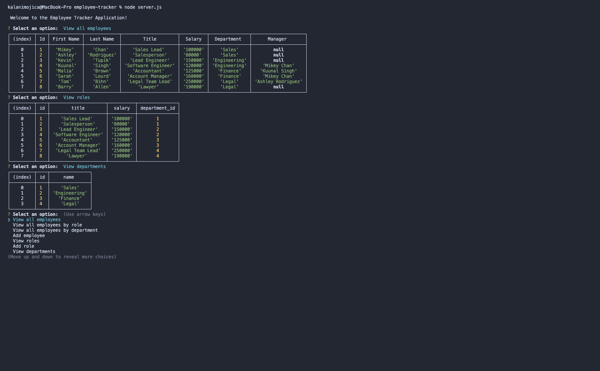

# employee-tracker

## Description 
The Employee Tracker application helps users build and maintain employee data. 

## Demo

## Instructions
In order to use this application: 
- Run npm install to install the dependencies that are in the json package. 
- Run node server.js to display the welcome message and start the prompts. 
- The program will walk you through your selected option.

## Technology Used 
- MySQL
- Express.js
- Node.js
- Javascript
- Git
- GitHub

## Author
Kalani Mojica 
- [LinkedIn](https://www.linkedin.com/in/kalani-mojica-132042206/)
- [Github](https://github.com/mojikalani)
- [Portfolio](https://mojikalani.github.io/portfolio/)